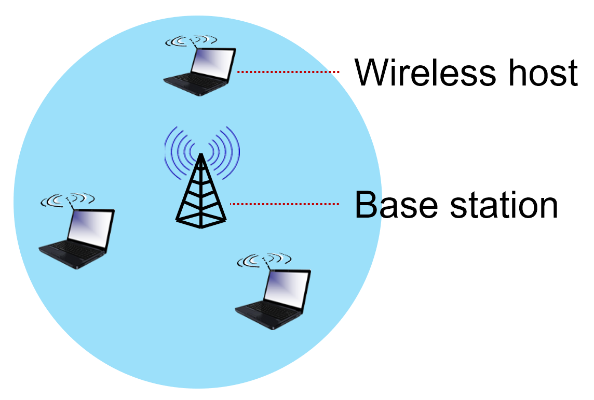
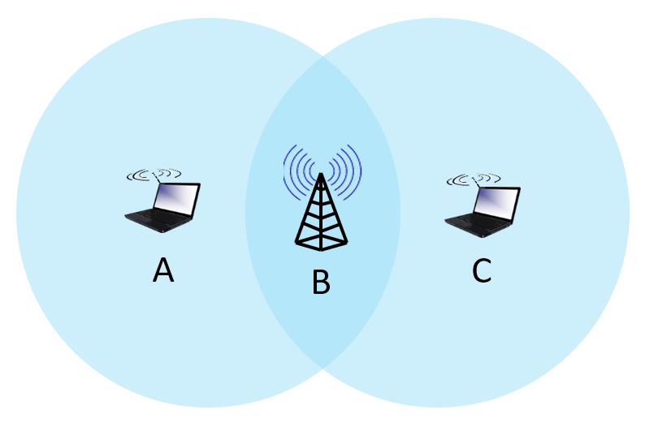

# 무선 네트워크의 구성 요소



- Wireless host : 무선 기기(노드)
- Base Station : 유선으로 연결된 네트워크를 다른 노드들에게 제공
- Link : 두 노드간 무선으로 연결된 네트워크

무선 네트워크는 두 가지 종류가 있다.

- Infrastructre mode : Base station이 다른 노드들에게 네트워크를 제공하는 것
- Ad-Hoc mode : Base station이 없고, 노드간 무선 네트워크를 구성하는 것

# Hidden Terminal Problem



B는 A와 C 모두 범위 내에 있기 때문에 통신이 가능하지만 A는 C와 직접적인 통신이 되지 않는다. 게다가 B에게는 A의 신호가 C의 신호와 같이 들리기 때문에 충돌이 일어날 수 있다. 이 상황에서 A는 C의 신호가 들리지 않고 C 또한 마찬가지이므로 충돌이 없다고 생각하여 계속 신호를 보내게 된다.

# CDMA (Code Division Multiple Access)

각 링크에 연결된 두 노드간에 미리 정해진 코드를 통해 신호를 인코딩 디코딩 하는 것이다.

같은 주파수 대역을 사용하면서 모든 유저가 동시에 채널을 사용할 수 있는 장점이 있다.

## Encoding

각 타임 슬롯마다 보낼 신호에 미리 정해진 코드값을 각각 내적하여 인코딩한다.

```
             t1           t0
data :       -1     |      1
       -------------+------------ 
code :  -1  1  1 -1 |  1  1 -1 -1

-> inner product ->

             t1           t0
data :   1 -1 -1  1 |  1  1 -1 -1
```

## Decoding

인코딩된 신호에 미리 정해진 코드값을 곱한 후 각 타임 슬롯마다 더하여 원래의 신호로 디코딩한다.

```
             t1           t0
data :   1 -1 -1  1 |  1  1 -1 -1
       -------------+------------ 
code :  -1  1  1 -1 |  1  1 -1 -1

-> inner product ->

             t1           t0
data :  -1 -1 -1 -1 |  1  1  1  1

-> sum and divide by code length ->

             t1           t0
sum  :      -4      |      4
       -------------+------------ 
data :  -4 / 4 = -1 |   4 / 4 = 1
```

이 방법은 두 개 이상의 신호가 곱해져도 (잡음이 더해져도) 원래의 신호를 디코딩할 수 있다.

# 802.11

802.11은 무선 통신을 위해 사용하는 표준 규격이다. 

## 구성 요소


- Access Point : Base Station을 AP라고 명명한다.
- Base Station Set : Infrastructure로 구성되어 무선 네트워크를 제공하는 영역이다.

AP관리자는 각 AP가 사용할 주파수를 설정할 수 있는데, 다른 AP와 동일한 주파수를 사용하면 충돌이 일어날 수 있다. 

## 새로운 노드가 BSS에 접속할 때

1. AP가 브로드캐스트하는 Beacon Frame을 수신한다.
2. AP의 이름인 SSID와 AP의 MAC 주소를 획득한다.
3. AP가 인증을 요구할 경우 인증을 진행한다.
4. DHCP로 IP 주소를 할당받아 네트워크에 참여한다.

## Passive Scanning

AP가 지속적으로 BSS내에 Beacon Frame을 송신한다. BSS에 접속한 노드는 수신한 frame을 전송한 AP에게 Request Frame을 보내어 핸드쉐이크를 한다.

## Active Scanning

BSS에 접속한 노드가 Request Frame을 브로드캐스트한다. AP가 Request Frame을 수신하면 Response Frame을 송신한다.

여러 AP에게서 Response Frame이 전달되어도 노드 스스로 선택한 AP와 핸드쉐이크를 한다.

## CSMA/CA (Collsion Sense Multiple Access / Collision Avoid)

Hidden Terminal Problem과 같이 무선 연결의 경우 충돌을 감지하기 어렵다. 따라서 데이터 전송 전에 가능한 충돌을 회피하기 위해 기다리는 방법으로 발전하게 되었다. 

### 송신측

- 채널을 사용한 후 기다려야할 최소 시간(DIFS)이 지난 후에 채널이 유휴상태라고 판단되면 frame을 전송한다.
- 채널을 누가 사용하고 있는것 같다면,

    1. 임의의 시간만큼 기다린다.
    2. 전송한다.
    3. ACK이 없으면 1번으로 돌아가서 더 긴 시간을 기다린다.

### 수신측

수신이 완료되었다면 ACK 신호를 보낸다.

### RTS, CTS frame

1. 송신측 노드는 먼저 작은 RTS(Request To Send) 신호를 AP에게 전송한다. 이 때 충돌이 발생할 수 있지만 frame의 크기가 작아서 충돌이 거의 없다.
2. RTS 신호를 받은 AP는 CTS(Clear To Send) 신호를 브로드캐스트하여 모든 노드에게 전송하지 말라는 신호를 보낸다.
3. 다른 노드는 모두 전송을 중단하게 되고 송신측 노드만 전송을 하게 된다.
4. 전송이 완료되면 AP는 ACK신호를 브로드캐스트하여 다른 노드들에게 전송이 끝났음을 알린다.

## 802.11 Frame Format


- Receiver MAC Address : frame을 수신하는 노드의 MAC 주소
- Transmitter MAC Address : frame을 송신하는 노드의 MAC 주소
- Router MAC Address : AP와 유선으로 연결된 라우터의 MAC 주소

BSS 내의 무선 네트워크에서는 802.11 WiFi frame으로 통신하지만, BSS바깥의 라우터로 전송될 때는 Ethernet frame으로 바뀌어 전송된다.

## Mobility in same subnet

같은 서브넷에서 한 AP에 연결된 노드가 다른 AP로 이동하게 되면 스위치의 포워딩 테이블 또한 변경되어야 한다. 노드의 MAC 주소를 보고 노드와 연결된 스위치 테이블의 포트를 업데이트하여 노드의 위치를 업데이트하게 된다.

## Power Management

노드가 배터리를 절약하기 위해 절전 모드(Sleep)로 들어가되 AP와 연결은 유지하고 싶은 경우다.

노드가 AP에게 다음 Beacon Frame까지 sleep하겠다고 신호를 보내면, AP는 다음 Beacon Frame까지 그 노드에게 신호를 전송하지 않는다. 대신 노드는 다음 Beacon Frame에 절전 모드에서 깨어난다. 

# Cellular Networks

노드가 이동하여도 수많은 기지국(Base Station = Cell)들 중 하나와 연결되어 네트워크에 참여할 수 있는 것을 Cellular Network라고 한다. 

## 구성 요소

- 모바일 디바이스

  스마트폰이나 노트북과 같은 기기를 말하는데, SIM 카드에 담긴 고유 식별자인 ISMI로 노드를 구분한다.

- Base Station

  AP와 비슷하게 범위 내의 노드들의 무선 네트워크를 관리한다. 또한 무선 스펙트럼을 스스로 관리하고 노드가 다른 Base Station으로 이동했을 때 상호작용한다.

- HSS (Home Subscriber Service)

  홈 네트워크에 가입한 노드들의 정보를 저장하고 있다.

- S-GW (Serving Gateway), P-GW (PDN Gateway)

  S-GW는 Base Station과 P-GW사이에서 라우팅하여 사용자 정보를 전달한다(?).

  P-GW는 LTE 네트워크와 더 큰 네트워크 사이에서 NAT기능을 제공한다.

- MME (Mobility Manager Entity)

  가입자와 네트워크간 인증을 담당한다. 이 때 가입자의 인증정보를 얻기 위해 HSS에 접근하게 된다.

  또한 노드의 이동성을 관리하여 다른 Base Station으로 이동했는지 추적, 관리한다.

  노드와 P-GW간 터널링의 경로를 설정하는 역할도 담당한다.

## Data Plane 

LTE에서 

- Packet Data Convergence : IP 헤더 압축, 암호화 및 복호화
- Radio Link Control : 패킷의 fragmentation 및 assemble, 
- Medium Access