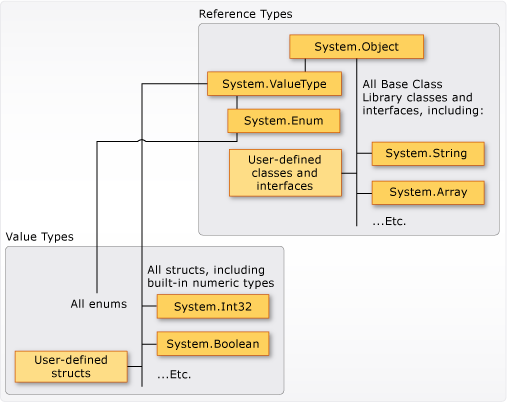

# CTS

C#의 모든 형식은 기본 형식에서 파생된 또는 상속된 형식이다. 모든 형식은 `System.Object`로부터 파생된다. 이렇게 기본 형식에서 파생되는 구조를 공용 형식 시스템(Common Type System)이라고 한다.

# 형식

CTS의 모든 형식은 Value와 Reference로 나뉜다. 



사진을 참고하면 `Int32`, `Boolean`과 같이 기본 자료형이라 생각되는 것들은 전부 값 형식이다. `struct` 키워드로 생성한 형식도 값 형식이다. 특이하게도 `System.Enum`은 값 형식이 아니지만 그것으로부터 파생된 Enum들은 전부 값 형식이다.

반면 `String`, `Array`는 참조 형식이다. 사용자 지정 클래스, 인터페이스 또한 참조 형식이다. 

## 값 형식

값 형식은 변수에 값이 직접 담긴다. 스택에 할당되기 때문에 가비지 컬렉션이 돌아가지 않는다. 게다가, 값 형식은 `sealed`이기에 다른 형식을 만들 수 없다. 즉, 상속되지 않는다. 

할당 시에, 파라미터로 전달할 때, 함수가 결과를 반환할 때 값이 복사되어 전달된다.

## 참조 형식

참조 형식의 종류로는 `class`, `record`, `interface`, `delegate` 그리고 배열이 있다.

참조 형식에 인스턴스의 참조를 저장하기 전까지는 null이 담겨있다. 인스턴스가 생성되면 힙에 메모리가 할당되고, 변수에는 그 인스턴스의 참조가 저장된다. 아무도 참조하지 않는 인스턴스는 가비지 컬렉터가 자동으로 회수한다.

특이하게도, 배열은 값 형식이 저장되어 있더라도 참조 형식으로 생각한다.

```csharp
int[] arr = {1, 2, 3, 4, 5}; // reference
```

`sealed` 키워드로 선언된 클래스가 아니라면 상속으로 다른 형식을 생성할 수 있다.

## 암시적 형식

js나 파이썬처럼, 변수의 타입이 암시적인 언어들이 있다. C#에서 암시적인 형식을 만들려면 `var` 키워드를 사용하면 된다.

## Nullable

값 형식은 null을 가질 수 없다. 하지만 형식 뒤에 `?`을 추가하면 null을 허용하는 형식이 된다.

# 참고 자료

[C# 형식 시스템 | Microsoft Learn](https://learn.microsoft.com/ko-kr/dotnet/csharp/fundamentals/types/)

[Type system of GoC Seminar Ralf Vogler TUMnchen | Slidetodoc.com](https://slidetodoc.com/type-system-of-goc-seminar-ralf-vogler-tumnchen/)