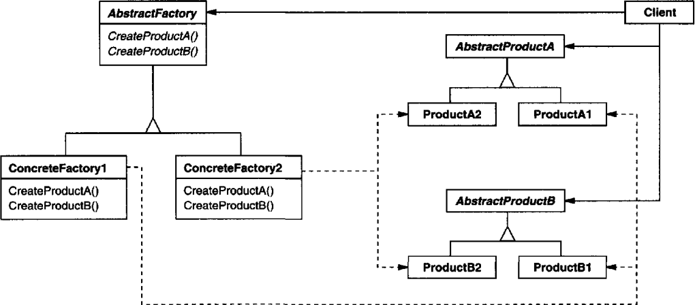

# 의도

서로 관련성이 있거나 독립적인 여러 객체의 **집합**을 생성하기 위한 인터페이스를 제공한다.

# UML



사용자는 추상 팩토리를 통해 A와 B를 생성하게 된다. 이 때 어떤 팩토리를 사용하느냐에 따라 다른 종류의 제품을 생성할 수 있게 된다.

위 다이어그램에 새로운 제품 C가 등장했다고 가정할 때 모든 추상 팩토리의 서브 클래스에 C를 생성하는 메서드를 제공해야 한다. 이것 때문에 확장에 어려움이 있다.

# 사용 시기

- 클래스 라이브러리를 제공하되 구현이 아닌 **인터페이스**를 노출하고 싶을 때
- 관련된 객체들이 **함께 사용되도록** 설계되었고, 이 부분에 대한 제약이 지켜지길 바랄 때

    > 자동차 뼈대, 타이어, 차 유리를 팩토리로 생성하게 만들면 자동차와 관련된 객체들은 이 팩토리를 이용하여 생성하도록 강제된다.

- 여러 제품군 중 하나를 선택해서 시스템을 설정해야 하고, 한번 구성한 제품을 쉽게 대체할 수 있어야 할 때
    
    > 자동차 추상 팩토리는 경차, 중형차 또는 대형 버스 등 여러 구체 팩토리 클래스가 생길 수 있다. 이들은 모두 자동차 추상 팩토리에 정의된 인터페이스에 의존성을 가지므로 한 구체 팩토리 클래스는 다른 구체 팩토리 클래스로 쉽게 대체될 수 있다.

# 장점

팩토리는 **객체를 생성하는 과정과 책임을 캡슐화한 것**이므로, 사용자로부터 구체적인 구현 클래스가 분리된다. 팩토리의 인터페이스에 의해 생성된 인스턴스를 조작하게 되므로, 클래스 이름이 드러나지 않게 된다. (사용자가 직접 생성하지 못하도록 강제?)

추상 팩토리를 상속받아 구체 팩토리를 구현하고, 구체 팩토리를 이용해 인스턴스를 생성할 때 구체 팩토리는 단 한 번 등장하게된다. 그러므로 인스턴스를 변경하지 않고 *구체 팩토리를 변경하는 것만으로도* 같은 군에 속하는 다른 객체를 사용할 수 있게 된다.

인스턴스를 생성하기 위해 무조건 팩토리를 사용하므로, 같은 군에 속하는 객체들만 사용하도록 일관성을 가지게할 수 있다.

# 단점

기존에 정의된 추상 팩토리를 확장하기 어렵다. 추상 팩토리에 새로운 객체를 생성하는 연산을 정의할 경우 모든 구체 팩토리에서 그 연산을 구현해야하기 때문이다.

# 구현

자동차에 필요한 차 뼈대, 타이어, 유리창을 생성해야한다고 가정하자.

이들은 모두 자동차 부품 공장에서 생산되므로 하나의 팩토리에서 생성할 수 있다.

```cpp
// 자동차를 생성하는 인터페이스를 가진 추상 팩토리다.
class VehicleFactory {
public:
    VehicleFactory();

    virtual CarFrame* MakeCarFrame()
        { return new CarFrame(); }
    virtual Tire* MakeTire();
        { return new Tire(); }
    virtual CarGlass* MakeCarGlass()
        { return new CarGlass(); }
}
```

VehicleFactory라는 추상 팩토리를 정의한 후 이 추상 팩토리를 상속받아 구체 팩토리 클래스로 만들어 사용하면 된다.

> 책에서 제시한 예제에서는 추상 팩토리를 추상 클래스로 정의하지 않았는데, 인터넷에 올라와 있는 다른 예제들은 추상 클래스로 정의되어 있다. 
만약 유리창이 필요없는 자동차를 만든다고 하면 필요없는 연산을 정의해야하므로 추상클래스로 선언하지 않은 것 같다.

같은 추상 팩토리를 상속받아 버스를 만드는 팩토리도 구현할 수 있다.

```cpp
class BusFactory : public VehicleFactory {
public:
    BusFactory();

    virtual CarFrame* MakeCarFrame()
        { return new BusFrame(); }
        // BusFrame은 CarFrame을 상속한다.
        // BusTire, BusGlass도 그렇다.
    virtual Tire* MakeTire();
        { return new BusTire(); }
    virtual CarGlass* MakeCarGlass()
        { return new BusGlass(); }
}
```

SUV를 생성하는 구체 팩토리 클래스를 구현할 수도 있다.

```cpp
class SUVFactory : public VehicleFactory {
public:
    SUVFactory();

    virtual CarFrame* MakeCarFrame()
        { return new SUVFrame(); }
        // SUVFrame은 CarFrame을 상속한다.
        // SUVTire, SUVGlass도 그렇다.
    virtual Tire* MakeTire();
        { return new SUVTire(); }
    virtual CarGlass* MakeCarGlass()
        { return new SUVGlass(); }
}
```

각 부품을 생성하여 차량을 생성하는 메소드가 있다고 할 때, 버스를 생성해야한다면 아래처럼 요청하면 된다.

```cpp
void MakeVehicle(VehicleFactory &factory){
    CarFrame* carFrame = factory.MakeCarFrame();
    Tire* tire = factory.MakeTire();
    CarGlass* carGlass = factory.MakeCarGlass();
    ...
}

BusFactory busFactory;
MakeVehicle(busFactory);
```

만약 SUV를 생성해야한다면 단순히 구체 팩토리만 바꿔 요청하면 된다.

```cpp
SUVFactory suvFactory;
MakeVehicle(suvFactory);
```

만약 자동차 부품이 추가되어 사이드 미러를 달아야하는 변경점이 생겼다고 하자. 추상 팩토리에 사이드미러를 생성하는 연산이 추가되었다면 구체 팩토리에도 모두 추가되어야 한다. 이런 점에서 불가피한 수정이 필요하므로 비용이 생긴다.

## 싱글턴 팩토리

추가 바람