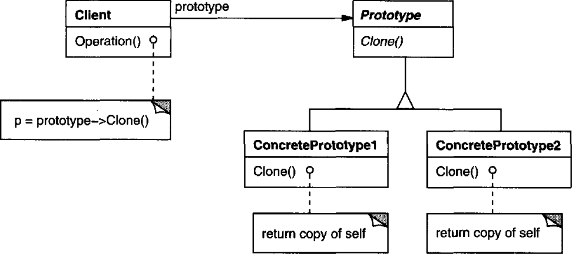

# 의도

프로토타입이 되는 인스턴스를 사용하여 생성할 객체의 종류를 명시하고, 이렇게 만든 견본을 복사하여 새로운 객체를 생성한다.

# UML



프로토타입을 관리하는 클래스(`Client`)는 각 프로토타입을 알고 있어야 한다. 객체 생성 요청이 들어올 때 각 프로토타입을 복제하여 생성 과정을 진행하기 때문이다.

각 프로토타입들은 **자기 자신을 복제하는 메서드를 필수로 구현해야한다**.

사용자가 Client에게 객체를 생성해달라는 요청을 하게 되면 Client는 각 프로토타입들을 복제하여 생성 과정을 진행한다.

# 사용 시기

- 인스턴스화할 클래스를 런타임에 지정하고 싶을 때
- *병렬 클래스 구조*를 일으키는 팩토리 메서드를 사용하고 싶지 않을 때

# 장점

팩토리 메서드에서는 객체를 생성하기 위해 팩토리 클래스가 병렬로 연결되어야 하지만, 프로토타입 패턴에서는 **등록된 인스턴스를 복제해달라고 요청하기만** 하면 되므로 서브 클래스의 수가 줄어든다.

객체를 생성할 때 객체 내에서 동일한 인스턴스를 생성하기 위해 많은 비용이 필요하다면 프로토타입 패턴으로 **비용을 절감**할 수 있다.

# 단점

프로토타입의 서브 클래스가 무조건 `clone` 메서드를 구현해야한다. 만약 서브 클래스를 수정할 수 없는 상황이라면 이 패턴을 적용하기 힘들다.

# 구현

자동차를 생성해야하는데, 부품들을 생성하기 위해서는 많은 비용과 시간이 든다고 하자.

이런 경우에는 각 부품(프로토타입)들을 미리 생성해둔다음 단순히 사본을 찍어 낸다면 불필요한 요청을 하지 않아 비용을 줄일 수 있다.

```cpp
class CarPrototypeFactory {
public:
    CarPrototypeFactory(CarFrame* cf, Tire* t, CarGlass *cg){
        _protoCarFrame = cf;
        _protoTire = t;
        _protoCarGlass = cg;
    }

    virtual CarComponent* MakeCarFrame() const;
    virtual CarComponent* MakeTire() const;
    virtual CarComponent* MakeCarGlass() const;
private:
    // 프로토타입들
    CarFrame* _protoCarFrame;
    Tire* _protoTire;
    CarGlass* _protoCarGlass;
}
```

자동차의 프로토타입을 제공하는 클래스를 만든다. 

이 클래스의 생성자를 통해 각 부품(프로토타입)을 등록한다. 메서드에는 프로토타입을 복제하는 연산을 실행한다.

```cpp
// in CarPrototypeFactory class

CarFrame* CarPrototypeFactory::MakeCarFrame() const {
    return _protoCarFrame->clone();
}

Tire* CarPrototypeFactory::MakeTire() const {
    return _protoTire->clone();
}

// 부품들을 복제하는 메서드들을 구현한다.
// ...
```

복제될 부품(프로토타입)들은 모두 `clone`을 구현해야한다. 인터페이스를 통해 복제하는 메서드를 제공한다면 그 메서드를 구현하도록 강제할 수 있다.

```cpp
class CarComponent {
public:
    virtual CarComponent clone() = 0;
}

class CarFrame : public CarComponent {
public:
    CarFrame();
    CarFrame(CarFrame& cf) {
        // 복제를 위해 필수적으로 복사하는 메서드를 구현해야한다.
        // C++에는 복사 생성자가 있기 때문에,
        // 자기 자신(프로토타입)을 그대로 복사 생성자의 인자로 넘겨
        // 간단히 복제할 수 있다.
    }

    virtual CarComponent* clone() {
        return new CarFrame(*this);
    }
}
```

사용자는 등록된 프로토타입을 복제하여 새로운 인스턴스를 생성할 수 있다.

```cpp
CarPrototypeFactory newCarFactory(
    new CarFrame(), 
    new Tire(), 
    new CarGlass()
);

// 각 부품을 복제하여 새로운 자동차 생성
Car* car = MakeCar(newCarFactory); 
```

이렇게 등록된 프로토타입들의 인스턴스를 복제함으로 새로운 객체를 생성할 수 있다.

만약 복사 생성자만으로 초기화하는 것이 부족하다면 별도의 초기화 함수를 정의한 후, `clone` 메서드 안에서 복제된 인스턴스의 초기화 함수를 호출하면 된다.