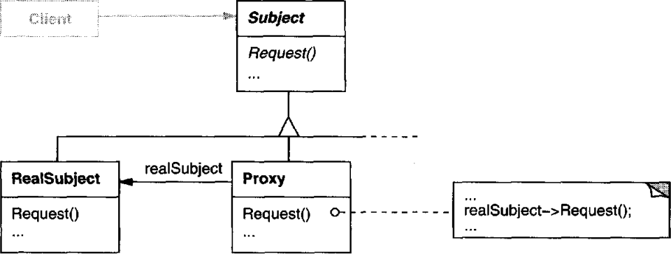

# 의도

다른 객체에 대한 접근을 제어하기 위한 대리자 또는 Placeholder 역할을 하는 객체를 두기 위해 쓴다.

# UML



RealSubject는 Subject 인터페이스를 상속한 서브 클래스다. 사용자는 Subject 인터페이스를 통해 RealSubject를 조작하려고 한다.

여기서 직접 RealSubject를 사용하는 대신, Subject를 상속받은 Proxy 클래스를 사용한다.

Proxy 클래스는 RealSubject가 제공하는 인터페이스를 똑같이 제공하나 세부 구현은 프록시의 종류에 따라 다르다.

# 사용 시기

- **다른 주소 공간에 있는 객체**에 접근하고자 할 때 → **원격지 프록시**
- **생성 비용이 큰 객체**를 정말 필요할 때 생성하고자 할 때 → **가상 프록시**
- 어떤 객체에 대해 **각자 접근 권한이 달라 제어가 필요할 때** → **보호용 프록시**
- **스마트 포인터**처럼 객체에 접근이 일어날 때 추가적인 처리가 요구될 때. **스마트 포인터**는 객체를 아무도 참조하지 않게 된다면 그 때 객체를 삭제한다.

# 장점

객체에 접근할 때 *간접층*(level of indirection)을 제공한다. 프록시의 종류 또는 책임에 따라 다양하게 사용할 수 있다.

- **원격 프록시** : 객체가 다른 주소 공간에 있음을 숨길 수 있다.
- **가상 프록시** : 객체에 대한 추가적 정보를 통해 실제 객체에 대한 접근을 지연시킨다.
- **보호용 프록시, 스마트 포인터** : 객체에 접근할 때마다 추가적인 관리를 할 수 있다.

# 단점

???

# 구현

프록시 객체는 실제 객체와 똑같은 인터페이스를 제공해야 한다.

실제 객체에 대한 접근을 제어하고 생성과 삭제를 책임진다.

## 가상 프록시

이미지를 불러와야 하는데 생성 시점에 모든 객체에게 생성 요청을 보내면 비용이 어마어마하게 든다. 따라서 사용자가 진짜로 필요하다는 요청을 보낼 때에만 생성하도록 이미지 객체를 프록시 객체로 대체하여 사용하도록 한다.

```cpp
class IGraphic {
public:
    virtual void Draw();
    virtual Point* GetSize();
    virtual Metadata* GetMetadata();
}

class Image : public IGraphic {
public:
    Image() { /* 매우 큰 크기의 이미지를 불러옴 */}

    virtual void Draw() { /* 이미지를 그림 */}
    virtual Point* GetSize() { return _size; }
    virtual Metadata* GetMetadata() { return _metadata; }
private:
    Metadata* _metadata;
    Point* _size;
}
```

가상 프록시 객체는 이미지가 가지는 인터페이스와 동일한 인터페이스를 제공해야 한다.

```cpp
class ImageProxy : public IGraphic {
public:
    ImageProxy() {
        _metaData = new MetaData();
        _size = new Point();
    }

    virtual void Draw() { GetImage()->Draw(); }
    virtual Point* GetSize() { return GetImage()->GetSize(); }
    virtual Metadata* GetMetadata() { return GetImage()->GetMetadata(); }

private:
    Image* GetImage() {
        // 필요한 시점에 Image 객체를 생성한다.
        if(_image == nullptr) {
            _image = new Image();
        }
        return _image;
    }
    Metadata* _metadata;
    Point* _size;
}
```

가상 프록시 객체는 이미지 객체와 동일한 인터페이스를 제공하지만, 가상 프록시 객체에게 요청할 때가 되면 그제서야 이미지 객체를 생성하여 요청을 전달하게 된다.
