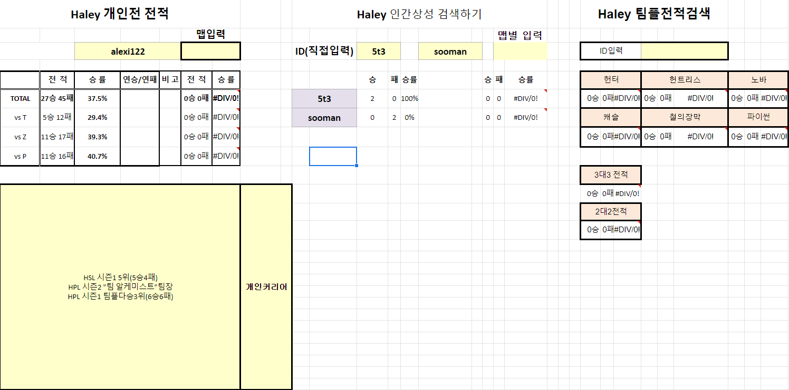
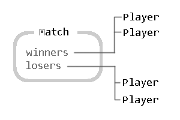
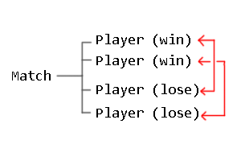
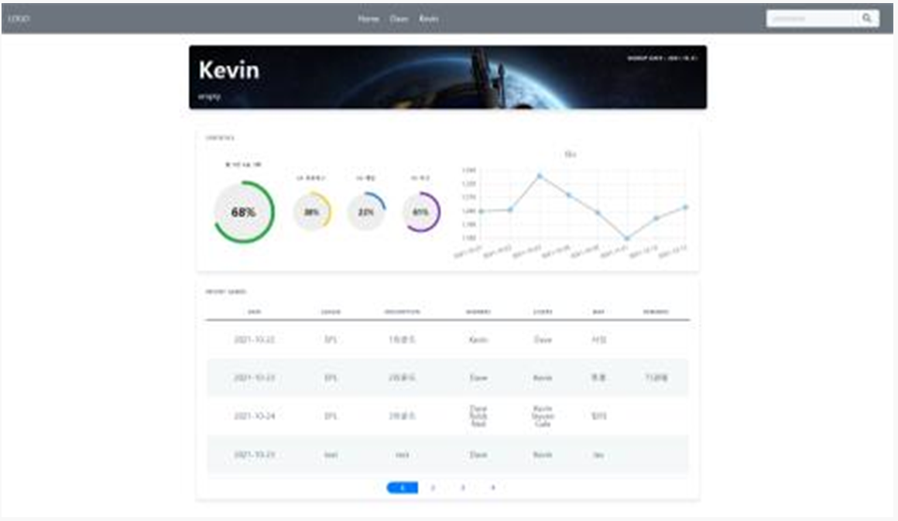
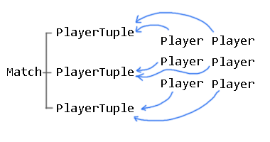

# 동기

Haley클랜(이하 할리클랜)에 가입하여 맵퍼로 활동을 하다가, 카페 내에서 **전적검색기**를 스프레드시트로 관리하는 것을 보았다.



클랜원끼리 경기를 치르면 전적이 생긴다. 이 전적들을 모아서 통계를 볼 수 있게 만들어져 있었는데, 관리 도구가 스프레드시트이다보니 불편한 점이 여러가지 있었다. 

디자인부터 마음에 안들었다. 그리고 스프레드시트를 열어야 하니 접근성이 떨어졌다. 플레이어의 전체 통계와 승률을 볼 수 있었지만, 특정 리그에서의 전적을 보기 불편하다는 점도 있었다. 

군대에서 친구를 통해 **Django**를 접하게 되었고, 웹 서비스에 대해 천천히 알아가면서 이 불편한 점을 고쳐보자는 생각을 갖게 되었다. 전역 후 제대로 시작해보자는 마음에 21년 9월부터 개발을 시작했다.

# 무작정 시작하기 (21년 9월)

배운거라고는 유튜브에서 **Django** 튜토리얼과 **DRF** 튜토리얼 영상을 보면서 따라해본 것과 공식 문서를 훑어본 것, 그리고 **VueJs** 튜토리얼을 따라한 것밖에 없었다. 머릿속으로는 어떻게 만들면 되겠다가 간단하게만 정리되어 있었다. 

개인 프로젝트는 이번이 처음이었고, 계획도 제대로 수립하지 않은 상태로 진행했으니 결과는 제대로 나오지 않았다. 간단하다고 생각한 기능들이 실제로는 고려할 점이 많았다.

## (Server) 잘못된 모델 설계

우선 다뤄야할 데이터를 모델로 구현하는 것부터 난관이었다.

한 경기에 담겨있는 정보는 다음과 같다.

- 경기 날짜
- 리그
- 맵
- 게임 제목
- **플레이어 목록** (2~n, 2보다 많을경우 팀플 경기를 의미)
    - 플레이어
    - 플레이어의 **종족**

리그, 맵은 모델을 분리하여 관계를 설정하면 되지만, **플레이어 목록**이 문제였다. 

```python
# Model structure MK1

class Profile(models.Model):
    name = models.CharField()
    signup_date = models.DateField()

class Player(models.Model):
    profile = models.ForeignKey(Profile, on_delete=models.CASCADE)
    race = models.CharField()

class Match(models.Model):
    # miscellaneous fields... (league, map, title, date, etc.)

    winners = models.ManyToManyField(Player)
    losers = models.ManyToManyField(Player)
```

경기에 이긴 사람과 진 사람을 나누어 **ManyToMany**로 연결했다. 

**Player** 모델은 **Profile** 모델과 종족 필드를 갖는다. 

**Profile** 모델은 플레이어의 기본적인 정보를 담고 있다. 

이 구조를 그림으로 표현하면 이렇다.



플레이어의 종족은 **매 경기마다 달라질 수 있기 때문에** Player 모델을 만들어 플레이어를 구분하기 위한 Profile 모델과 종족을 연결지어 놓았다. 그리고 Match 모델에 연결시켰는데, 누가 승자이고 패자인지 직관적으로 구분할 수 있게 **winners** 필드와 **losers** 필드를 만들어 두었다. 

이상하게도, Player 모델 관리를 특이하게 했었다. 

Player는 테란, 프로토스, 저그 중 1개의 종족을 갖게 된다. 따라서 각 종족별로, 총 3개의 Player 인스턴스를 미리 만들어 두고, 경기 결과를 저장할 때 *미리 만들어둔 인스턴스 중 맞는 종족값을 가진 인스턴스*를 연결시켰다. 

이렇게 만든 모델을 이용해 개발하다가 통계를 내는 쿼리를 짜기 복잡하다는 것을 깨닫고 모델 구조를 단순하게 만들어야 한다는 것을 깨달았다. 게다가, 이해하기 복잡하다.

```python
# Model structure MK2

class Profile(models.Model):
    name = models.CharField()
    signup_date = models.DateField()

class Match(models.Model):
    # miscellaneous fields... (league, map, title, date, etc.)

class Player(models.Model):
    profile = models.ForeignKey(Profile, on_delete=models.CASCADE)
    match = models.ForeignKey(Match, on_delete=models.CASCADE)
    opponent = models.ForeignKey("self", on_delete=models.CASCADE, null=True)
    win_state = models.BooleanField()
    race = models.CharField()
```

winners, losers 필드를 제거하고, Player 모델에 Match 모델을 연결시킴으로 관계를 단순화했다.

그리고 상대가 누군지 알아야할 필요성이 생겨 opponent 필드를 추가해 관계를 구성했다.



Match 인스턴스에 연결된 Player 인스턴스로 간단한 구성이었지만, 자기 참조관계가 문제였다. 

새 데이터를 추가하려고 하면 Player목록을 만들고 **상대를 직접 연결해줘야 했다.** 상당히 복잡한 구조여서 고쳐야겠다고 마음을 먹었다. 하지만 이미 이 모델을 기반으로 짜여진 코드들이 많아서 새로 프로젝트를 시작하기로 결정했다. 데이터베이스를 조금 더 공부했었다면 이런 일이 없었을 것이다. 

## (Client) UI 프레임워크를 너무 믿었다

Django 템플릿을 배울 때, UI를 디자인하기위해 **Bootstrap**을 이용했었다. 이제는 반응형 웹페이지를 위해 필수가 되어버렸는데, **VueJS 3**로 개발하는 환경에서는 이용할 방법을 못찾았다.

가능한 UI 프레임워크를 다 찾아봤는데 **Quasar, Vuestic, Primevue, Naive, Balm** 등 꽤 많았다. 그 중에 **Vuestic**은 설치과정이 깔끔하고 문서도 잘 정리되어있어 활용하기도 편했다. 



남아있는 사진이 없어서 흐릿한 이미지라도 긁어왔다

사진은 개인 전적 페이지인데 Vuestic으로 개발한 모습이다. 차트는 ChartJS를 이용했고 파이모양 그래프는 직접 svg로 그렸다. 

개발을 막 시작할 땐 마음에 들었는데, 세세한 부분을 디자인하려고 하니 Vuestic 내에서 방법을 찾을 수 없었다. 게다가 전적 입력을 하려면 **Validation**이 필요했는데, 이것 또한 지원을 안하는 것 같았다. 

결국 제자리걸음을 반복하다가 서버를 갈아엎게 되면서 다른 UI 프레임워크를 찾게 되었다. 그렇지만 서버 때문에 갈아엎은건 아니었다. 

근본적인 이유는 UI 프레임워크만 있으면 따로 CSS를 다루지 않아도 된다 생각한게 문제였다. 그리고 **더 필요한 도구가 있다면 직접 개발해 활용할 수 있어야** 했는데, **UI 프레임워크에 다 있을거라 믿고 땜질식으로 개발했던게** 이유였다. 나중에는 **PrimeVue**와 **PrimeFlex**를 활용하면서 필요할 때는 CSS를 적절히 사용했다. 

# 한 번 갈아엎고  (22년 2월)

지지부진한 개발속도를 보고 더는 안되겠다 싶어서 다시 처음부터 시작했다. 이 때 편의점 야간 알바를 시작하면서 밤새 코딩하다가 새벽을 맞이하는 날들이 이어졌다. 

## (Server) 개선된 모델

프로젝트를 새로 시작한 이유는 복잡한 모델 때문이었다. 이 때 파워 오브 데이터베이스라는 책으로 진행한 스터디에 참여했었는데 약 한 달 정도였지만 정규화나 무결성을 따져보는 방법에 대해서 공부했었다. 


이전 모델에 대한 분석

직접 관계도를 그려보면서 문제점을 찾아보기도 했었는데, 역시나 상대가 누군지 알아야 한다는게 이중레코드를 만들게 된다는 결론에 이르렀다. 

```python
# Model structure MK3

class Player(models.Model):
    name = models.CharField()
    signup_date = models.DateField()

class Match(models.Model):
    # miscellaneous fields... (league, map, title, date, etc.)

class PlayerTuple(models.Model):
    match = models.ForeignKey(Match, on_delete=models.CASCADE)
    winner = models.ForeignKey(Player, on_delete=models.CASCADE)
    loser = models.ForeignKey(Player, on_delete=models.CASCADE)
    winner_race = models.CharField()
    loser_race = models.CharField()
```

첫 번째 모델 구조와 많이 유사하지만 관계가 매우 단순해졌다. 

본인의 상대를 관계로 구성하지 않고, **필드값을 추가함**으로 매우 쉽게 알 수 있다. 



모델이 확고해지자 개발 과정이 순탄해졌고 다른 고민을 할 수 있게 되었다. 

## (Server) 실시간 Elo 레이팅

옛날 LOL에는 **MMR**이 존재했는데, 이 점수는 자신과 비슷한 수준의 상대를 만날 수 있는 기준이었다. 체스에서도 객관적 실력 측정을 위해 **Elo 레이팅**을 사용한다. 우리 할리클랜에서도 Elo 레이팅을 활용하고 있었다. 당연히 스프레드시트로 관리했기 때문에 손이 매우 많이 가는 작업이었다.

개인 전적 조회 기능을 개발 완료한 후 Elo 레이팅을 관리하는 방법에 대해 몇 주를 낭비했다. 계산하는 방법은 잘 알고 있었지만, **경기 결과가 수정되었을 경우** Elo 레이팅은 어떻게 처리되는지 알고 싶었다. 

어떻게든 최적화된 쿼리로 수행해내는 코드를 짜고 싶었지만, ORM에서는 SQL을 완벽하게 따라하지 못한다는 것을 깨달았다. 

예시로, 어떤 블로거는 1번의 쿼리로 Elo를 계산하는 SQL쿼리를 만들었는데 RECURSIVE를 사용하고 있었다. ORM에서 활용할 수 있을까 찾아봤지만 그런 내용은 없었다.

구글을 열심히 찾아보고 스택오버플로우에 질문도 해봤는데, 결국 **데이터가 수정되었다면 Elo를 구하기 위해 다시 연산을 수행해야한다**고 했다. 약간 미친 짓같지만, 요즘 성능으로는 거뜬하다는… 내용이었다. 

[ELO rating - mysql design](https://stackoverflow.com/questions/26043337/elo-rating-mysql-design)

[Optimal table design for ELO system](https://stackoverflow.com/questions/71999007/optimal-table-design-for-elo-system)

그래서 업데이트를 수행하는 View를 만들고 그 뷰에 **정기적으로 요청을 넣는 방법**을 채택했다. 

현재까지 쌓인 데이터의 수는 약 3천건이라서 성능이 부족해도 충분히 계산할 수 있었지만 내가 선택한 방법이 정말 옳은 것인지는 모르겠다. 1억건 이상의 데이터가 있었다면 어떻게 해야했을까?

## (Server-Client) 작지만 큰 실수들

### CORS

웹에는 CORS라는 정책이 있는데, 출처가 다른 자원을 사용하지 못하게 강제하는 정책이다. 보안상의 이유인데, 사용자의 정보를 탈취하는 자원을 사용하도록 유도할 수 있기 때문이다. 

이 정책은 서버-클라이언트 간에도 적용되는데, 서버가 특정한 클라이언트만 자원을 사용할 수 있다고 **Response의 헤더를 통해 알려주면** 클라이언트는 그제서야 이용이 가능하다. 

이 개념을 제대로 이해하지 않고 클라이언트의 헤더에 잘못된 옵션을 넣어서 사용했었다. 하루종일 삽질을 했는데 결국 개념을 제대로 이해하는 것이 정답이었다.

# 서비스 시작 (22년 3월~)

로컬환경에서 목표했던 기초 기능들을 완성했고, 시험용으로 배포를 해도 될 상황이었다. op.gg, [poro.gg](http://poro.gg) 등 gg도메인을 구입해 사용하려 했으나 가격이 15만원으로 매우 비쌌다. 생각했던 도메인은 haley.gg였는데 돈 때문에 haleygg.kr로 결정했다… 

**네이버 클라우드**에 마이크로 서버를 구축하고, 클라이언트는 **Netlify**에 배포를 하면 되겠다고 생각했다. VueJS는 빌드를 거치면 정적파일이 나오니까 충분했다. 

## (Server) 원격 서버 구축

문제는 원격 서버 구축은 처음이었다. 리눅스는 고등학생 이후로 만져본 적이 없어서 정말 간단한 명령어들밖에 모르고 있었다.

**Nginx**와 **uWSGI**를 설치하고 구동하는 데에만 사흘이나 걸렸다. 화장실 갈 때 빼고 자리에서 일어난 적이 없었던 것 같다. Https를 적용하기 위해 **LetsEncrypt**도 활용했다. 

설치과정은 블로그에 정리했다.

[AWS 프리티어 + Nginx + uWSGI + Django 설치](https://10cheon00.tistory.com/2)

그런데, 생각했던 것만큼 네이버 클라우드 서버가 빠르지 않았다. 응답하는데 평균 **500ms**정도 걸렸는데, 토이프로젝트로 코로나19앱을 만들 때 사용한 **아마존 프리티어 서버**가 월등히 빨랐다는 것을 알게 되었다. 

게다가 Netlify에 배포한 클라이언트에 접속할 때도 느릿느릿 동작하는 모습을 보고 다른 서버를 활용해야겠다고 느꼈다. 결국 아마존에 서버를 구축하고, 네이버에 클라이언트를 배포했다. 

# 후기

내 입맛대로 개발한 프로젝트지만 이걸 실제로 사용자들에게 배포하는 과정을 겪어본 점에서 나에게 의미가 매우 크다.

개발을 시작할 때는 바로 모델, 뷰 등을 작성했었지만 개발 막바지에 들어서 테스트를 작성하며 **테스트 주도 개발**의 필요성을 느꼈다. 다른 프로젝트를 시작할 때 TDD를 적용해 시작했더니 미묘하지만 잘 작동하더라.

Git에도 그날 한 내용을 한 번의 커밋으로 올려버렸더니, 나중에 커밋 로그를 읽을 때 매우 이해하기 힘들었다. 이후 협업할 때 사용하는 컨벤션을 적용해 여러 개로 쪼개 커밋하니 어떤 기능을 개발했는지 눈에 확 들어왔다. 

이제 다른 사람들이 따라가는 **규칙이나 암묵적인 룰**이 있다면 나도 그것을 지켜야 개발속도가 올라간다는 것을 깨달았다.